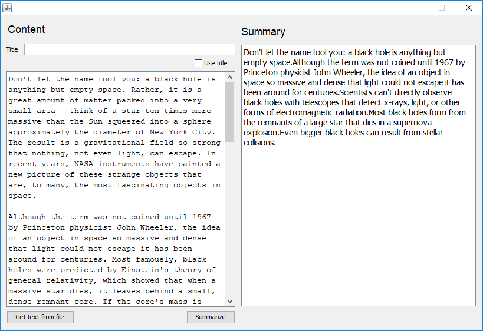
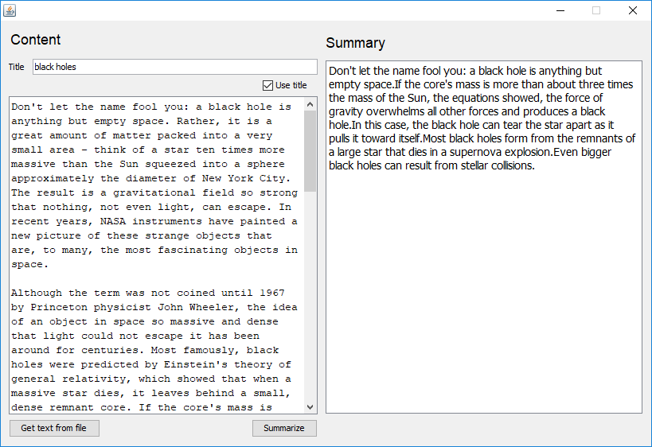

# Summarizer

> A simple text summarization in java

The resume consist of relevant sentences from each paragraphs. 
After several process, such as stop words removal, stemming or lemmatization, 
sentences are compared to each other or to the title to determine the most relevant ones.

## Examples

Using [nasa article](https://www.nasa.gov/audience/forstudents/k-4/stories/nasa-knows/what-is-a-black-hole-k4.html) about black holes.

### Without title
``` bash
java Summarizer text-sample.txt

    Don't let the name fool you: a black hole is anything but empty space.Although the term was not coined until 1967 by Princeton physicist John Wheeler, the idea of an object in space so massive and dense that light could not escape it has been around for centuries.Scientists can't directly observe black holes with telescopes that detect x-rays, light, or other forms of electromagnetic radiation.Most black holes form from the remnants of a large star that dies in a supernova explosion.Even bigger black holes can result from stellar collisions.

``` 



### Using title

``` bash  
java Summarizer text-sample.txt "black holes"

    Don't let the name fool you: a black hole is anything but empty space.If the core's mass is more than about three times the mass of the Sun, the equations showed, the force of gravity overwhelms all other forces and produces a black hole.In this case, the black hole can tear the star apart as it pulls it toward itself.Most black holes form from the remnants of a large star that dies in a supernova explosion.Even bigger black holes can result from stellar collisions.```
```



## Dependencies

The project depend on [OpenNLP](http://opennlp.apache.org/)